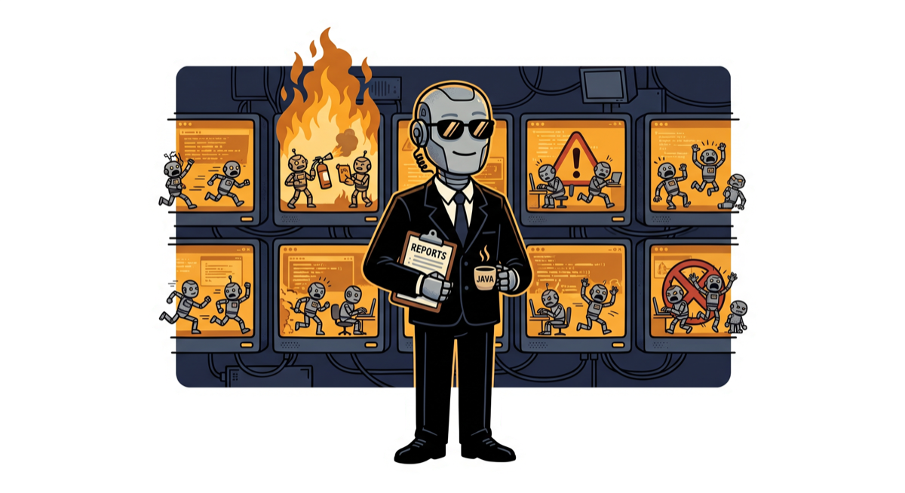

# S.H.I.E.L.D.

**Strategic Herding, Intervention, Escalation & LLM Dispatch**

<p align="center">
  
</p>
<p align="center"><em>Coulson, reporting. The fleet is fine. One screen is on fire. This is normal.</em></p>

A personal harness for running a *fleet* of autonomous coding agents — many tickets in
parallel, each in its own git worktree, each following a shared playbook — with the human
doing exactly two things: approving plans, and answering escalations. Everything else is
LLM-driven, watched by a deterministic first mate.

> *"Agents of S.H.I.E.L.D."* was sitting right there. We took it.

## The cast

| Name | Role |
|---|---|
| **You** | Fury. One eye on everything, appears only when it matters. |
| **coulson** | The handler — *C.O.U.L.S.O.N.: Coordinated Orchestration of Unattended LLM Streams, Oversight & Notifications*. A Claude session you talk to; brings you the fleet's gates and escalations with context, relays your answers into streams, dispatches new work. |
| **rfleet** | Ops. A zero-token bash watcher: scans every stream's state, emits attention items, wakes Coulson, and fires a dead-man notification if nobody answers in time. |
| **the agents** | The streams. One coordinator per ticket, in its own worktree, executing the playbook end to end with builder subagents and cross-model review. |
| **the playbook** | The Code (*"more like guidelines, really"* — painfully accurate for LLM instruction-following). The tool-neutral workflow every stream follows. |

## The one rule

> Any time new code is written — review fixes, QA fixes, PR-comment fixes — it must pass
> **fresh-eyes review** (a different model family) again; if it could affect functionality,
> it gets **QA'd** again too. A loop that hasn't converged after ~3 passes **escalates to
> a human**.

That single rule generates every loop in the system, so the flow itself stays a straight
line: triage → plan (🧑 gate) → build → review → QA → ship. See `playbook/workflow.md`.

## Commands

```
shield stream <ticket>   dispatch an agent of S.H.I.E.L.D. (worktree + coordinator)
shield coulson           put Coulson on duty (fleet watcher + attention handler)
shield watch             fleet watcher alone (RFLEET_SHADOW=1 = observe only)
shield status            fleet at a glance
shield usage [--roles]   token accounting: harness overhead vs ticket work
shield browser           ensure the shared QA Chrome (persistent profile, :9222)
shield build|forward|resume|clean   stream lifecycle
```

Every command also exists under its original `r*` name (`rstream`, `rcaptain`, `rfleet`,
`rstatus`, `rusage`, ...). The `rt*` prefix is the previous tmux generation, kept as a
working fallback (`RDEV_COORDINATOR=coordinator-v1` pins its old brain).

## Architecture, briefly

- **Playbook** (`playbook/`) — tool-neutral WHAT: stages, gates, loops, QA method menu.
  Copied into each worktree at dispatch. Any harness (Claude Code, Cursor, Codex, remote
  agents) can execute it by providing six operations: state/resume, an implementer, a
  fresh-eyes reviewer, a test runner, a QA executor, and a human channel.
- **Coordinator** (`agents/coordinator.md`) — the Claude Code binding: `state.json`,
  builder subagent per task, adversarial review via the Codex plugin (OpenAI reviews
  Claude's diff), QA in whole rounds against full-stack PR preview environments,
  evidence required in every PR, comment rounds until quiet. Never merges.
- **First mate** (`bin/rfleet` + `agents/coulson.md` + `bin/rcaptain`) — attention
  routing: deterministic detection + dead-man fallback in bash; LLM judgment only where
  judgment matters (context, relay/redirect, dispatch). Design:
  `docs/plans/first-mate-orchestrator-design.md`.
- **QA browser** — one long-lived Chrome (`--remote-debugging-port`, persistent
  signed-in profile) that all agents attach to via the chrome-devtools MCP, each in
  its own tabs. No login walls, no profile lock races.
- **Metering** (`bin/rusage`) — local transcript accounting with per-model pricing;
  `--roles` separates harness overhead (Coulson) from ticket work. Dollar figures are
  counterfactual API list prices, not a bill.

## Honest status

Personal, private, opinionated, and under heavy iteration. Currently coupled to one
target repo (paths and preview-URL pattern in `~/.rdev/config`) and to macOS
(terminal-notifier, Chrome paths). A clean installable distribution is an aspiration,
not a promise. Living state: `docs/handover-*.md`.
