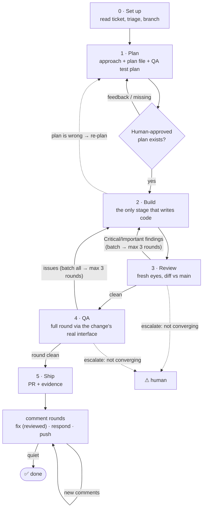

# Ticket workflow

The end-to-end flow for taking a piece of work (usually a Linear ticket)
from intake to a merged PR. It is **tool-neutral**: you can follow it by
hand or with any coding agent (Cursor, Codex, Claude Code, ...). Each stage
links to a short doc with the details — this page is only the flow.

> **Status: opt-in.** This workflow is an option, not (yet) the team standard.
> It is currently distributed by the rdev harness (copied into each worktree
> at `.claude/rdev/playbook/`); when the team adopts it, it moves into the
> rhythms repo as `docs/workflow.md` verbatim. Use it by telling your tool:
> *"Follow the workflow playbook for this ticket."*

## The flow

**THE RULE (this is what creates every loop):** any time new code is
written — review fixes, QA fixes, PR-comment fixes — it MUST pass
fresh-eyes review again; and if the change could affect functionality, it
must be QA'd again too. A loop that hasn't converged after ~3 passes
escalates to a human.

| # | Stage | What happens | Exit |
|---|-------|--------------|------|
| 0 | [Set up](workflow/0-setup.md) | Read the ticket (if there is one), get on the right branch | On the work's branch, goal understood |
| 1 | [Plan](workflow/1-plan.md) | Explore, decide approach, write the plan incl. QA test plan | **A human-approved plan exists** — approved live, pre-approved before dispatch, async via ticket comment, or spec-as-approval for well-spec'd tickets (see 1-plan) |
| 2 | [Build](workflow/2-build.md) | Implement the current batch task by task | Batch done, local tests pass |
| 3 | [Review](workflow/3-review.md) | Independent fresh-eyes review of the diff | Clean (no Critical/Important) |
| 4 | [QA](workflow/4-qa.md) | Full QA round — every change, UI or backend | A QA round comes back clean |
| 5 | [Ship](workflow/5-ship.md) | PR with evidence, comment rounds until quiet | A round brings no new comments |

**Build is the only stage that writes code.** Review and QA are detectors:
whatever they find goes back into Build as one batch, and The Rule sends the
result through Review (and QA, if functionality could be affected) again.
The one human gate is plan approval; otherwise humans come in on
**escalation** — a loop that isn't converging.

## How The Rule plays out per stage

- **Review (3):** Critical/Important findings go back to Build as one batch
  (no triage — trust the review); fixes get a fresh-eyes re-review. Same
  findings twice in a row, or 3 rounds → escalate.
- **QA (4):** a round walks the *whole* test plan, noting every issue
  without stopping to fix. The batch goes to Build → Review → full QA round
  again. 3 rounds still finding issues → escalate.
- **Ship (5):** PR-comment fixes are reviewed before pushing; if a fix could
  affect functionality, re-run the relevant QA steps too. Rounds continue
  **until one brings no new comments**.
- **Re-plan hatch (2/3/4 → 1):** if any stage reveals the plan's *approach*
  is wrong — hidden dependency, wrong assumption, real scope change — update
  `docs/plans/<ticket-id>.md`, re-approve if scope materially changed,
  resume. (Tasks merely taking longer is not a re-plan.)

## What a harness must provide

This playbook is the program; a harness (Claude Code, Cursor, Codex, a
future cloud runner) executes it by providing five operations. *How* each
is implemented doesn't matter — *that* it exists does:

1. **State** — persist the current stage and loop counters (review rounds,
   QA rounds, comment rounds) so a fresh session can resume mid-pipeline.
2. **Implementer** — something that writes code from a task batch: an
   agent, a subagent, or a person.
3. **Fresh-eyes reviewer** — a reviewer that has not seen the
   implementation happen: a different model where available, otherwise a
   fresh session/context.
4. **Test runner** — a way to execute the test suites and prove they pass:
   the local dev container (Tier 1/2, isolated per worktree) or, for remote
   agents without one, CI on the pushed branch.
5. **QA executor** — the ability to run the stage 4 method menu: a real
   browser, real HTTP/MCP calls, job triggers.
6. **Human channel** — a way to reach a human for the plan gate and for
   escalations: live conversation, desktop notification, or a ticket/PR
   comment.

## Precedence: this playbook overrides repo skills

This repo ships agent skills (`.agents/skills/`) that agents may auto-invoke
while working. Most reinforce this workflow. When following this playbook,
**the playbook is the user instruction and takes precedence over any skill
that contradicts it** (the skills' own `using-superpowers` rules say user
instructions win). Three known collisions, by name:

1. **`test-driven-development` / `writing-plans` TDD mandates** — overridden
   by stage 2: tests are by builder judgment (write them where they add real
   protection; QA-found bug fixes always get a regression test).
2. **`finishing-a-development-branch`** — NOT part of this workflow. When
   Build completes, the next step is [stage 3: Review](workflow/3-review.md)
   — never this skill's merge/PR menu. (`executing-plans` and
   `subagent-driven-development` end by invoking it; skip that handoff.)
3. **Per-task review inside Build** (`subagent-driven-development`,
   `requesting-code-review`) — a welcome *extra* quality loop, but it does
   NOT satisfy stage 3: the fresh-eyes, different-model review of the full
   diff still runs after Build completes.
4. **Plan artifact locations** (`brainstorming`, `writing-plans` defaults) —
   overridden: design docs and plans live at `docs/plans/<ticket-id>*.md`
   (stage 1), NOT `docs/superpowers/specs/` or `docs/superpowers/plans/`.
   Build, QA, and Ship read from `docs/plans/<ticket-id>.md`; a plan saved
   anywhere else is invisible to the rest of the pipeline.
5. **Planning ceremony** (`using-superpowers`'s always-brainstorm rule,
   `brainstorming`'s questions + 2-3 approaches) — scaled by the
   [stage 0 triage](workflow/0-setup.md), which wins: lightweight tickets
   get 1-2 questions and ONE recommended approach; well-spec'd tickets skip
   clarifying questions entirely (spec translates straight to the plan).
   Full brainstorming ceremony is for design-size, under-specified work.

## Rules that hold across all stages

- Never work on `main` — always the work's own branch (see stage 0).
- The plan in `docs/plans/<ticket-id>.md` is the source of truth for scope.
- **The Rule:** no unreviewed code moves forward; functionality-affecting
  changes get re-QA'd.
- Every PR ships with **evidence** that the change works (stage 5).
